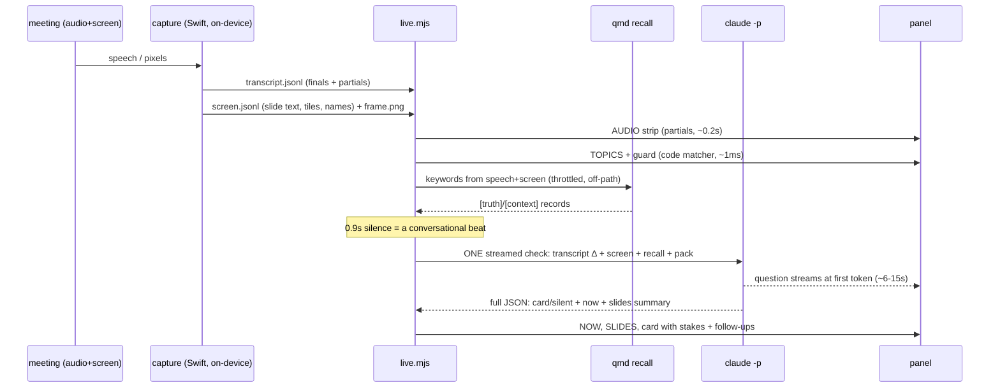
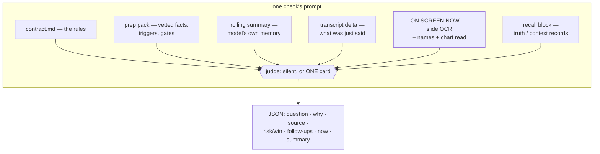
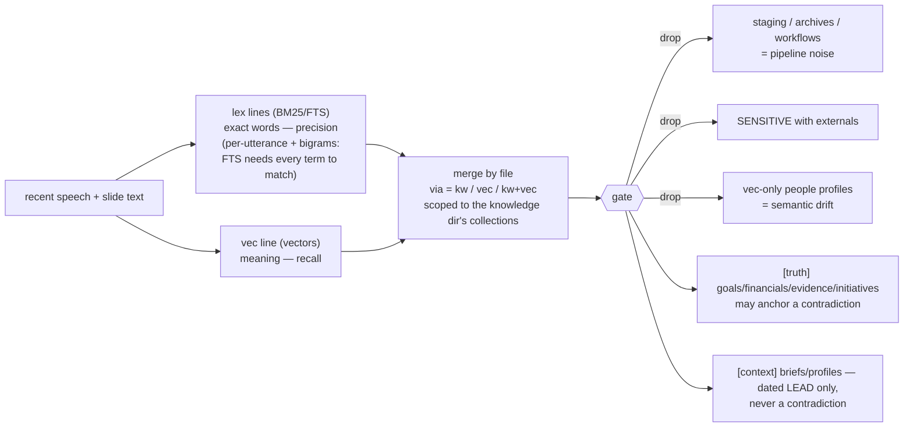
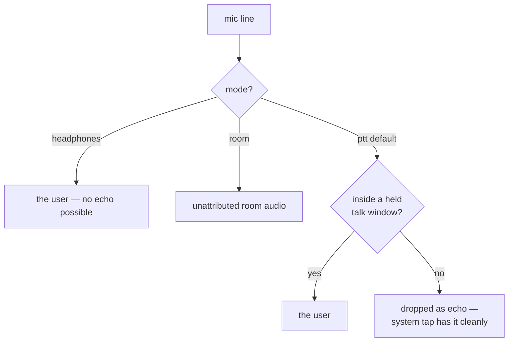

# How the meeting-copilot works — and why it's built this way

Companion to [README.md](README.md) (operations) and the
the design-history spec in the original home repo (not distributed).
This document explains the mechanisms and the principles that constrain them.

## Design principles

1. **Grounded or silent.** Every card must cite a specific held fact — a prep
   pack line or a truth-tier record. A meeting can end with zero cards; a
   generic "good question" is a bug, not a feature. Loosening this rule caused
   every quality problem the tool ever had.
2. **Inform, don't prescribe.** Cards name the question, never the user's
   position. A win card asks "worth naming that?", it doesn't script the
   recognition. (Enforced in the contract's lint section.)
3. **On-device first.** Colleagues' voices and screens are processed locally
   (SpeechAnalyzer, Vision OCR). What crosses the network is text — plus one
   deliberate, disableable exception (the chart-vision frame) — and only
   through the already-authenticated claude session.
4. **The room overrides the record.** The prep pack is a snapshot; the meeting
   is live. Who is present, what a number is now — the transcript wins.
   Retrieved records carry dates and are phrased as "I have X on file — is
   that current?", never as corrections.
5. **Latency is a feature.** Speech to visible question in seconds. Everything
   expensive — retrieval, vision, ambient extraction — runs OFF the card path
   and injects its results into the next check instead of blocking one.
6. **Honest UI.** Every inference channel is visible (TOPICS, CHECKING,
   SPEAKER, SLIDES, AUDIO), staleness is shown rather than papered over
   ("summarizing…", fades on scrollable areas), and failures surface on the
   panel — a permission error must never look like "no slides today".
7. **Code before model.** Matching, retrieval, provenance resolution, speaker
   geometry all run in deterministic, testable code. The model does the two
   things only a model can: judge relevance and phrase the question.
8. **The repo's rules bind the tool.** Writes go to `_staging` only (rule 10);
   `[SENSITIVE]`/`[CONFIDENTIAL]` never surface; goals come from
   `company/goals.md`.

## The pipeline, end to end



Only one model call runs at a time; speech arriving mid-call coalesces into
the next check (`inFlight`/`dirty`), which also avoids `claude -p` auth
contention.

## What one check actually sees

The prompt is assembled fresh per beat — the model holds no state except the
rolling summary it wrote last time:



Field order is deliberate: `question` first so it streams to the panel at
first token; `now`/`summary` last. The NOW topic is also extracted from the
stream mid-flight rather than waiting for the full JSON.

## Recall: the whole repo, without the noise

The prep pack is a precomputed retrieval; recall is the live one. Two channels
run in one `qmd query` call because they fail in opposite directions:



Scores aren't comparable across channels (kw tops ~87%, vec ~56%), so each has
its own floor and agreement (`kw+vec`) outranks either alone. A strong fresh
truth hit fires an immediate check instead of waiting for the next beat. When
a card fires, code — not the model — attributes which channel found its anchor
(the badge on the card).

## The screen-understanding ladder

Each rung costs more and knows more; each feeds the one above:

```
pixels ──▶ OCR text ──▶ gist ──▶ slide summary ──▶ chart read
(local)    (Vision,     (code    (model, 1-2       (vision pass on the
           window-      filter:  sentences,        frame image: trend,
           scoped,      chrome   pinned per        inflections — the
           top 12%      out)     slide)            shape OCR can't see)
           cropped)
```

- **Window-scoped**: only the meeting window is captured — the rest of the
  desktop (calendar, Slack, editors) doesn't exist to it. No meeting window →
  "no presentation detected".
- **Speaker** comes from geometry: tile labels are standalone OCR lines, and
  the active speaker's label renders larger than filmstrip labels. Names
  resolve against the people roster with tiered tolerance (exact > unique
  surname > unique first name > edit distance), and ambiguity refuses to guess
  — three Andys on the roster means a bare "Andy" matches nobody.
- **One vision call per settled slide** (4s stability), never on the card path.

## Attribution: who said what, honestly

The mic is a problem on speakers: it hears the whole call as echo while the
system tap already has that audio cleanly.



Downstream honesty follows from this: the digest attributes a commitment to
the user only from their own labeled lines, to a named person only when the
transcript or a slide names them, else "unattributed". The model may not list
the user as a speaker just because they own the session.

## Ambient: the listener that never interrupts

On a slow clock (~150s of meeting time), one cheap extraction call pulls
commitments and questions from the transcript AND the current slide — a
"DRI: Parker [ETA: 4/27]" written on a slide counts, quoted verbatim. Nothing
shows live; Ctrl-C turns the state into a digest plus raw-signal files in
`people/_staging` and `projects/_staging`, shaped exactly like the GATHER
workflows write so ANALYZE consumes them unchanged.

## The feedback loop: votes tighten, never loosen

Cards carry 👍/👎/dismiss. Every vote is appended to the session's
`feedback.jsonl` (the audit log) and consumed live by two mechanisms, both
built so they can only make the copilot QUIETER:

- **Volume**: net negative votes across distinct cards in the last 10 minutes
  (👎 = 1, dismiss = 0.5 — dismissing is ambiguous, so it counts half; 👍 = −1)
  widen the effective min-gap between cards: net ≥ 2 → 90s, ≥ 4 → 180s.
  Upvotes only offset negatives; the gap never drops below `--min-gap` and
  `--cap` never changes.
- **Topic**: the next check's prompt gains a FEEDBACK block quoting the voted
  questions (the model's own words — no user free text enters the prompt),
  instructing that a candidate resembling a downvoted card must clear a
  HIGHER bar, and that upvotes are not a request for more cards.

With zero votes both are exact no-ops — the prompt is byte-identical and the
gap stays at `--min-gap` — which is what keeps the replay gate (no feedback
events) meaningful.

Negative votes also persist: at meeting end the session's votes append to
`~/.meeting-copilot/feedback-history.jsonl` (capped at 200 lines), and the
next meeting seeds its FEEDBACK block with the last 30 days of downvoted
questions (max 10) from the very first check. History touches the prompt bar
only — never the mechanical gap — so a string of bad meetings makes the
copilot choosier, not mute. Delete the file to reset the bar.

## Latency budget

| Stage | Cost | On the card path? |
|---|---|---|
| speech → partial on AUDIO strip | ~0.2s | n/a (display) |
| final transcript line | 0.5–4.5s | yes (input) |
| beat debounce | 0.9s (15s max mid-monologue) | yes |
| model first token → question visible | ~6–15s (extended thinking) | yes — the floor |
| full JSON (now, stakes, summary) | +5–10s | trailing |
| topics / guard | ~1ms | no (code) |
| recall | ~0.2s kw + ~3s vec | no (background) |
| slide OCR | ~4s cadence | no |
| slide summary | next check (12s kick) | no |
| chart vision | ~10s, once per slide | no |
| feedback consume | ~0ms (two Map reads at prompt assembly) | no |

The floor is extended thinking, kept deliberately: it is what makes the model
actually cross-reference rather than pattern-match. `--think N` trades that
bar for speed, unvalidated.

## Failure design

The tool assumes its inputs lie and its plumbing breaks:

- **ASR lies about currency** → contradictions may not rest on a 10x/100x
  spoken dollar gap (the contract's magnitude rule).
- **OCR lies about glyphs** → O/0 and l/1 swaps can't anchor a contradiction.
- **The pack lies about live state** → the room's transcript is the authority
  on who is present and what is current.
- **Model responses break** → truncated/malformed JSON is repaired, and a card
  whose question already streamed is salvaged rather than silently retracted.
- **Permissions break silently by design (macOS)** → capture failures are
  emitted INTO the feed and rendered on the panel; TCC identity churn is
  prevented at the build layer (idempotent bundling + the meeting-copilot-dev cert).
