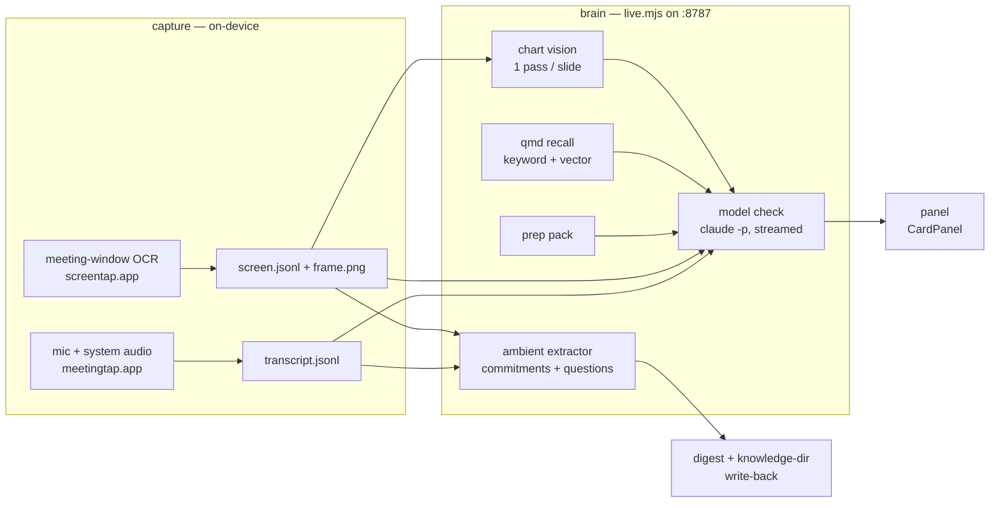

# meeting-copilot

Sits in a live meeting, listens to the audio, watches the meeting window, and
hands you ONE grounded question at a time — each resting on a specific fact
from your own notes. It never speaks for you: cards name the question, never
the answer (the rule: inform, don't prescribe). A meeting can end with zero
cards; that's the tool working, not failing.

Everything heavy runs on-device (transcription, OCR). The reasoning runs
through your existing Claude Code login — no API key.

## Principles

1. **The freshest version of what you know, in the room.** The prep pack and
   live recall pull your most current held facts into the meeting — the point
   is to close the gap between what you know and what you can summon under
   pressure. The room still outranks the record: retrieved facts arrive
   dated, phrased as "I have X on file — is that current?", never as
   corrections.
2. **It watches for collisions, drift — and wins.** Factual contradictions
   with your records; risks the room is glossing past (a concerning trend on
   the chart in view, a warning already written in your notes); drift against
   the goals you brought in; and good news worth naming out loud. Each fires
   only when it rests on a specific held fact — grounded or silent.
3. **Intelligence, not a recording.** It records nothing: audio and pixels
   are processed on-device, in real time, into text signals and one question
   at a time, and the working transcript is deleted when the meeting ends
   (recording, if you want it, is another tool's job). What persists is
   derived intelligence only — the digest's commitments in your knowledge dir
   and your card votes. `--keep-session` retains the transcript for replay
   tooling; the exceptions to "nothing leaves" are under Privacy posture.

Mechanisms + design principles: [HOW-IT-WORKS.md](HOW-IT-WORKS.md). The
knowledge layer (what the copilot knows): [portable/README.md](portable/README.md).
Design rationale and history live in the original home repo (not distributed).

## See it work in two minutes (no permissions, no mic)

Replaying a committed fixture through the real brain needs only `node` and a
logged-in `claude`:

```bash
node brain/brain-loop.mjs \
  --replay test/fixtures/rivertech/fixture.jsonl \
  --prep   test/fixtures/rivertech/prep-pack.md \
  --title  "Vendor Sync"
```

The fixture is a vendor renewal call where the vendor says the engagement is
"thirty five thousand flat" — but the prep pack holds the agreed SOW at
$42,500. About 30-60s in (one real model call per ~45s of meeting time) you
should see the copilot's one card: a question about which number is current,
citing the SOW fact. A second, softer card gets suppressed by the card
budget. That is the whole product in miniature: grounded collision in,
one question out, silence otherwise.

`./test/replay-gate.sh` runs the same replay with pass/fail assertions — it
is the regression gate for any change to `brain/`.

## Architecture



- **capture/** — Swift, all on-device. `meetingtap` taps the mic (AVAudioEngine)
  and system audio (Core Audio process tap) and transcribes with macOS 26's
  SpeechAnalyzer; channel `me` = mic, `them` = everyone else. `screentap` finds
  the meeting window (Meet/Zoom/Webex browser tab, the Zoom app, or a Drive
  recording playback), OCRs it with Apple Vision every ~4s, and emits slide
  text + participant-tile names + the latest frame.
- **brain/** — Node, zero dependencies. `live.mjs` debounces conversational
  beats, runs one streamed `claude -p` call at a time (existing login, no API
  key), and serves the panel over HTTP + SSE. `recall.mjs` cross-references the
  room against ALL of your knowledge dir's records (BM25 + vector via the
  local `qmd` engine, off the critical path). `ambient.mjs` quietly extracts
  commitments and unanswered questions for the end-of-meeting digest.
- **panel/** — NSPanel + WKWebView; floats over fullscreen meetings without
  stealing focus (never activate the app — that yanks the user out of the
  meeting's Space). All UI lives in `panel/index.html`, served fresh by live.mjs.

## The three journeys

The `copilot` command is the front door, organized by what you're doing rather
than by which binary does it. Each journey lives in its own directory as a
thin script plus a README; every underlying engine still works on its own.

| Journey | Command | Module |
|---|---|---|
| **Onboard** — install, build what the copilot knows, try it | `copilot onboard [knowledge \| import <dir> \| demo]` | [onboarding/](onboarding/) → `setup.sh`, `portable/`, the replay demo above |
| **Prep** — pick a meeting, build + view prep packs | `copilot prep [list \| <n> \| --pick \| show [name]]` | [prep/](prep/) → `portable/knowledge.sh`, `cli/events.mjs`; packs in `~/.meeting-copilot/prep/` |
| **Live** — run the copilot in the meeting | `copilot live [name] [flags]` | [live/](live/) → `start.sh` (capture + brain + panel), pack picked by name or start time |

`copilot prep list` numbers your upcoming meetings (via the `gws` CLI when
installed); `copilot prep 2` builds a pack for meeting 2 and stores it per
meeting. `copilot live` with no arguments picks the pack whose start time
brackets now. `copilot config set PREP_LOOKAHEAD_H 24` widens the calendar
window (default 12h).

## Quick start

One-time:

```bash
./copilot onboard        # or directly: ./setup.sh
```

That's the whole build: it gates on macOS 26 (the on-device transcriber's
floor), checks dependencies (swiftc, node, claude, optionally qmd), compiles
the capture binaries, offers to create the self-signed signing cert (so
permission grants survive rebuilds), bundles + signs the apps, and runs a
live permissions self-test — click Allow on the two dialogs.

Then build the knowledge dir — the facts the copilot grounds its cards in:

```bash
./copilot onboard knowledge      # guided intake wizard (~10-15 min), or:
./portable/knowledge.sh init     # bare config now, import/sync later
```

Each meeting:

```bash
./copilot prep list   # upcoming meetings, numbered
./copilot prep 1      # build the pack for meeting 1  (legacy: knowledge.sh pack --next)
./copilot live        # capture + brain + panel; Ctrl-C = digest  (legacy: ./start.sh)
```

First screentap launch prompts once for Screen Recording. `start.sh` also
refreshes the qmd recall index and backgrounds the embedding pass.

## What it surfaces

Live, on the panel:

| Section | What it is |
|---|---|
| **NOW** | current topic + whether it advances/risks a stated goal (▲/▼ + grounded note) |
| **SUGGESTIONS** | the cards: question + why + src (clickable — the original Sheet/email/Slack when resolvable via `origins.mjs`, the knowledge file as fallback) + ⚠ risk / ✦ win stakes + follow-up questions. A badge shows how the anchor was found (`pack` / `kw` / `vec` / `kw+vec`). |
| **TOPICS** | held facts the conversation AND slides are touching (code matcher, ~1ms) |
| **SPEAKER** | active speaker — largest standalone tile label, falling back to transcript-confirmed speakers |
| **SLIDES** | the model's 1–2 sentence read of the current slide ("summarizing…" while in flight; includes chart shapes from the vision pass) |
| **CHECKING** | which records recall is pulling right now |
| **AUDIO** | live transcript (partials stream in ~0.2s) |
| **guard** | amber warning when conversation or slides approach an `[INTERNAL]`/`[SENSITIVE]` fact with externals present |

End of meeting (Ctrl-C): digest of commitments — spoken AND slide-stated
("Resolve open threads (DRI: Parker)[ETA: 4/27]" counts) — plus questions that
never got answered, written back into the knowledge dir as raw signals
(staging inboxes when the layout has them, else a dated `meetings/` file).

Cards carry 👍/👎/dismiss buttons. Votes are consumed live, in one direction
only: recent negatives widen the gap between cards and raise the bar for
similar candidates; upvotes only offset negatives — feedback never makes the
copilot chattier. Negative votes also carry across meetings: the last 30 days
of downvoted questions seed the next meeting's bar from the first check
(see HOW-IT-WORKS "The feedback loop").

Card grounding is the one unbending rule: every card cites a specific fact —
the prep pack or a `[truth]`-tier record (goals, financials, evidence,
initiative logs). Triggers: contradiction, unraised open thread, decision
forming without data, unhit prep goal late, relevant fact in view — including
WINS the room is glossing past ("largest quarter on record — worth naming?").

## Mic modes

The "me" channel is the mic. On speakers the mic hears the whole call as echo
(the system tap already has that audio cleanly), so the default is push-to-talk:

| Mode | Flag | Behavior |
|---|---|---|
| push-to-talk | (default) | mic dropped as echo EXCEPT while holding the panel's "hold to talk" pill — those windows are you |
| headphones | `--headphones` | every mic line is you (no echo possible) |
| in-person | `--room` | mic kept as unattributed room audio |

## Privacy posture

- Audio and pixels are processed **on-device** (SpeechAnalyzer, Vision OCR).
- What leaves the Mac — all through the authenticated claude session:
  transcript TEXT, slide OCR TEXT, and the one pixel exception: the slide
  frame image for the chart-vision pass (one image per settled slide;
  `--no-vision` disables it).
- `[SENSITIVE]`/`[CONFIDENTIAL]` knowledge lines never surface in cards;
  recall drops them when externals are present; the guard warns on approach.
- No transcription is retained: the working transcript, screen feed and
  latest frame live in `~/.meeting-copilot/sessions/` during the meeting and
  are deleted at Ctrl-C (pass `--keep-session` to keep them — needed for
  `review-server` replays and fixture-making). The digest and feedback files
  remain. Only digest-derived raw signals land in the knowledge dir.

## Flags (start.sh passes unknowns through to live.mjs)

```
--prep <file>       specific prep pack (default ~/.meeting-copilot/prep-pack.md)
--headphones/--room mic mode (see above)
--no-screen         disable the screen OCR feed entirely
--no-vision         screen text yes, but never send the frame image
--no-recall         prep pack only; no whole-knowledge-dir retrieval
--no-staging        digest only; don't write the knowledge dir
--externals         force-arm the disclosure guard
--cap N             max cards per 30 min (default 20; model self-limits)
--keep-session      keep the transcript/screen feed after the meeting
                    (default: deleted at Ctrl-C — no transcription retained)
--debounce MS       beat detection (default 900)
--think N           cap/disable extended thinking (faster to first token,
                    but the quality bar is unvalidated without thinking)
```

## Testing without a meeting

```bash
./test/replay-gate.sh                  # the regression gate: replay + assertions
./selftest.sh                          # plays a phrase, verifies the system-audio tap
./capture/screentap --file img.png     # OCR one image, no permissions needed
node brain/brain-loop.mjs --replay ... # replay any transcript fixture (see top)
node brain/review-server.mjs           # watch a replay with cards popping at their timestamps
```

`meetingtap --file call.mp4 --out t.jsonl --anchor <iso>` turns any recording
into a fixture (~8x realtime, no permissions). Replaying a recording of a
real meeting exercises the whole stack — screentap treats the playback
window as the meeting window. `brain/eval-rubric.md` + `eval-workflow.js`
grade a replay's cards across precision / recall / prescription lenses.

Known ASR weakness: large currency figures transcribe wrong (`110000` for
"$11 million"). The contract forbids contradictions built on a 10x/100x spoken
currency gap; percentages, dates and statuses are reliable. OCR'd digits are
trusted except O/0 and l/1 swaps. `./run.sh --deepgram` is the opt-in cloud
path that buys diarization + correct currency ($0.41/audio-hour).

## Files

```
copilot             the front door: routes to the three journey modules + config
onboarding/ prep/ live/   one thin script + README per journey (the engines stay below)
cli/                events.mjs (calendar picker helpers) + common.sh (shared plumbing)
setup.sh            one-time: OS gate, deps, build, cert, bundles, permissions
start.sh            one command: capture + brain + panel; Ctrl-C stops + digests
run.sh              capture only (meetingtap + screentap + roster generation)
portable/           the knowledge layer: format spec, intake wizard, pack builder
brain/live.mjs      the server: checks, recall, vision, ambient, SSE, /open
brain/contract*.md  the operating rules the model is held to
brain/matcher.mjs   code-side fact matching (topics, guard, fast path)
brain/recall.mjs    whole-knowledge-dir retrieval (kw + vec) and the precision gate
brain/origins.mjs   provenance descriptors -> real Sheet/Gmail/Slack links
brain/ambient.mjs   commitments/questions -> digest + knowledge-dir write-back
capture/*.swift     meetingtap (audio) + screentap (screen) + TCC app bundles
panel/index.html    the whole UI; CardPanel.swift is just the floating window
experimental/       contracts that work but whose quality bar isn't validated
test/               replay-gate.sh + the rivertech fixture
```
