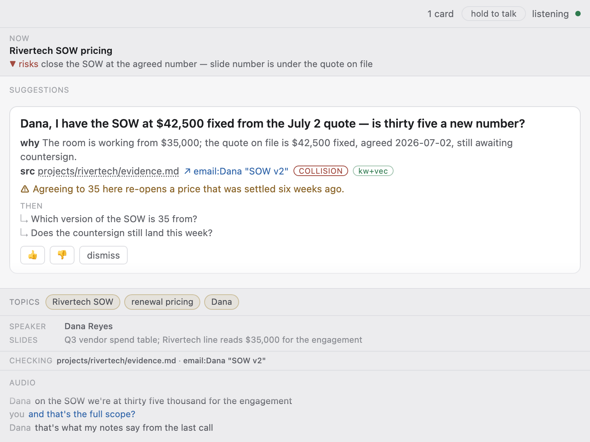

# meeting-copilot

Let's be real: you've walked out of a meeting and realised the answer was in
your notes the whole time. Someone quoted a wrong number and you nodded along,
because you couldn't dig up the right one fast enough.

This fixes that.

It listens, watches the shared screen, and when the room says something your
notes contradict, it hands you one question. Not advice, not a summary. A
question you can ask out loud. Most meetings it says nothing, which is the
point: it only speaks when it can cite something you wrote down.

It's not a recorder either. Audio and video never leave your Mac, nothing is
saved, and no bot with a weird name joins your call. Only you see it.



## What you need

A Mac on macOS 26 or later, since Apple's on-device transcriber ships with 26.
Claude Code, logged in, any paid plan. And a folder of notes, the real
requirement: no notes, nothing to cite, and it stays silent.

## Getting it running

```bash
git clone https://github.com/asupian/meeting-copilot.git
cd meeting-copilot
./copilot onboard
```

Ten minutes, mostly waiting. It compiles while a short Claude session asks
where you keep your notes (Obsidian, Notion, any folder) and makes them
searchable. macOS asks permission twice; click Allow. Then it preps a briefing
per calendar meeting.

Installing with an AI agent? Point it at [AGENTS.md](AGENTS.md).

## Using it

```bash
./copilot live
```

A small panel floats over the call. A card gives you the question, the fact
behind it, and a link to its source file. Thumb it down and it gets
pickier, now and in every meeting after.

Ctrl-C when you're done. You get a digest of who promised what and what nobody
answered, dropped into your notes. The transcript is deleted.

Briefings rebuild with `./copilot prep list`, then `./copilot prep 2`. No
calendar? Describe it: `./copilot prep --text "1:1 with Dana, pricing"`.

## What it flags

- **red, collision.** The room contradicts your records. Wrong number, wrong
  date, wrong owner, a settled decision getting reopened.
- **amber, gap.** Something's missing before everyone moves on. Your goal never
  came up, your question got dropped, a blocker nobody raised.
- **green, reinforce.** A fact worth tabling, or a win nobody noticed.

One card at a time, and red beats amber beats green. No fact, no card.

## Privacy

Audio and pixels stay on your Mac. Text doesn't: transcript lines, slide text
and facts from your notes go to Anthropic on every call, same as any Claude
Code session. Don't point this at a folder you couldn't send to a model. Tag a
fact `[SENSITIVE]` and it hides while outsiders are around. Transcripts and
logs are deleted at the end.

## FAQ

**What's this going to cost me?** Nothing extra, it runs on your Claude Code
subscription. One model call per beat of conversation, one at a time, 10 to 25
seconds each, so a busy hour is roughly 100 to 250 calls. That's my math from
the timing, not a measurement; your real number is in `perf.json`. Pro handles
a couple of meetings a day. If it's already your main tool, get Max.

**Will it die mid-meeting?** Maybe, on a heavy day. It fails loudly: the panel
says "brain unreachable" and capture keeps going, so you still get the digest.

**Do I have to tell people?** I'm not a lawyer, but "it deletes itself
afterwards" is not a defence: wiretap law cares about the listening, not the
file. In California, Illinois, Washington and others, assume everyone has to
agree. One sentence up front handles it: *"I run a local assistant that checks
my notes against what we're saying. Nothing is recorded."*

**Is my meeting text training the AI?** Your setting, not my promise to make.
Pro and Max train on your sessions unless you opt out under Settings, Privacy.
Team, Enterprise and API don't.

**Do I need `qmd` and `gws`?** Neither, though
[qmd](https://github.com/tobi/qmd) is worth it: without that index a card can
only quote the briefing built beforehand, instead of searching your notes live.
`gws` is my own Google Workspace CLI, not public, and it only reads your
calendar. Skip it, use `prep --text`.

**Which apps? Will people see it?** Zoom's app, or a browser window titled as a
Meet, Zoom, Webex or Teams call; anything else just costs you the slides strip.
English only for now. It shows on a screen share only if you share your whole
desktop.

**Cards take 6 to 15 seconds. Too late?** For rapid-fire standups, yeah.
Otherwise no: topics run for minutes, not seconds.

**How do my notes need to be organised?** Plain markdown in a folder.
`./copilot onboard knowledge` reads whatever you've got and never touches the
original. Notion needs no API token, just export to markdown and point at it.
Layout: [portable/KNOWLEDGE.md](portable/KNOWLEDGE.md). Thin notes means few
cards, maybe none. That's intended.

**Can I stop it writing into my notes?** `--no-staging`, or move the root with
`--knowledge <path>`. It never overwrites.

**Where's the push-to-talk key?** There isn't one, it's a "hold to talk" button
on the panel. On speakers your mic picks up you *and* a mangled echo of
everyone else, so you mark your own turns by holding it. Use `--headphones` on
headphones, `--room` in person. Get it wrong on headphones and everything you
say gets thrown out.

**How do I get rid of it?** Delete `~/.meeting-copilot` and the repo folder,
then drop meetingtap and screentap from System Settings, Privacy & Security. If
setup made a cert: `security delete-certificate -c "meeting-copilot-dev"
~/Library/Keychains/login.keychain-db`. Nothing else was touched.

**Is anyone actually maintaining this?** I built it for my own meetings and put
it up because it works. Issues and PRs welcome, no promises on timing. Two PR
rules: no dependencies, and `brain/` changes pass the replay gate.

## More

[HOW-IT-WORKS.md](HOW-IT-WORKS.md) is the mechanism,
[portable/README.md](portable/README.md) the notes layer.

Flags: `--cap` (20 per 30 min), `--min-gap` (0), `--no-screen`,
`--no-vision`, `--no-recall`, `--keep-session`, `--externals`, `--prep`.
Broken? `./copilot doctor` takes two seconds.
